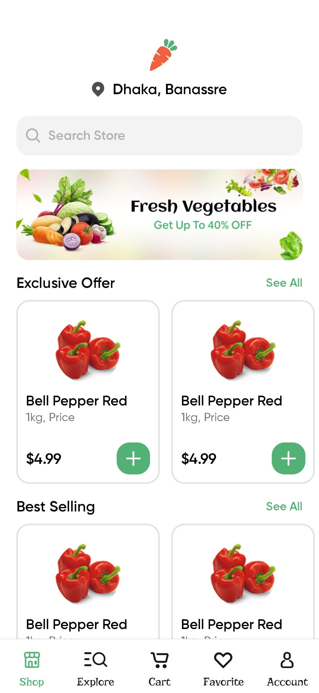
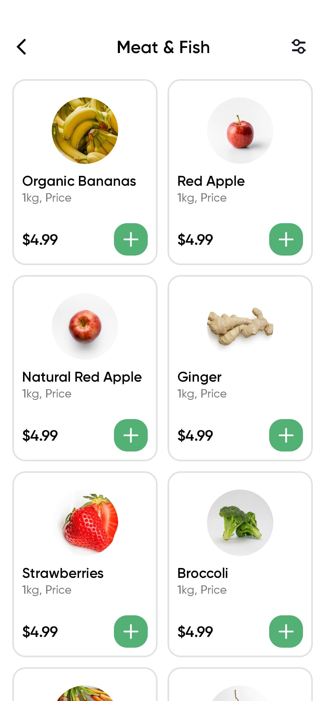
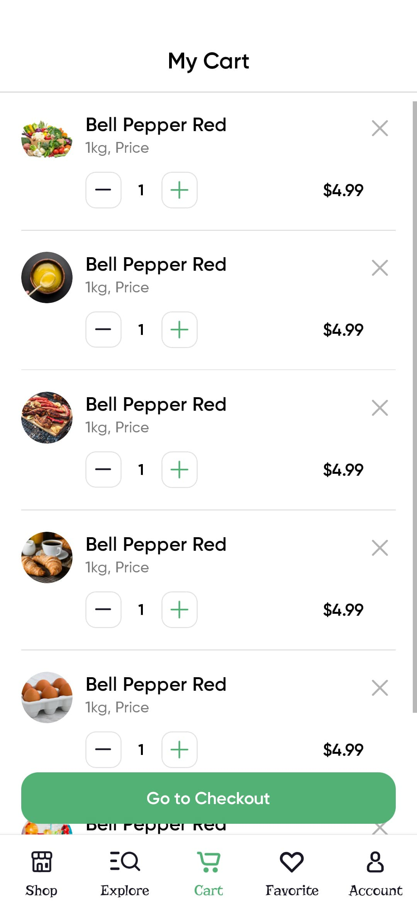
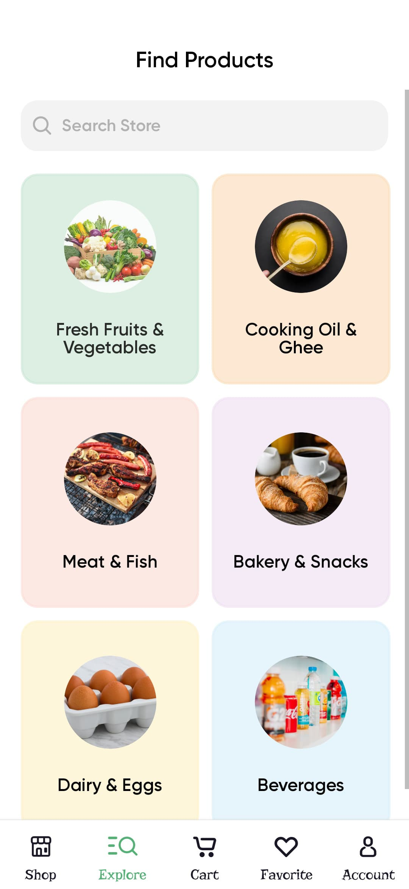
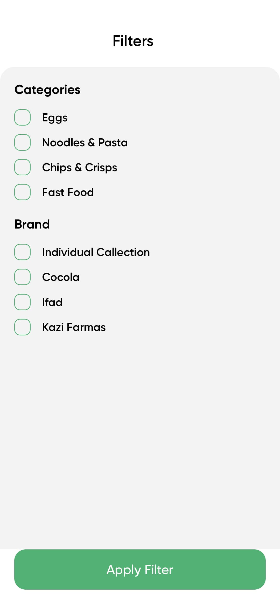
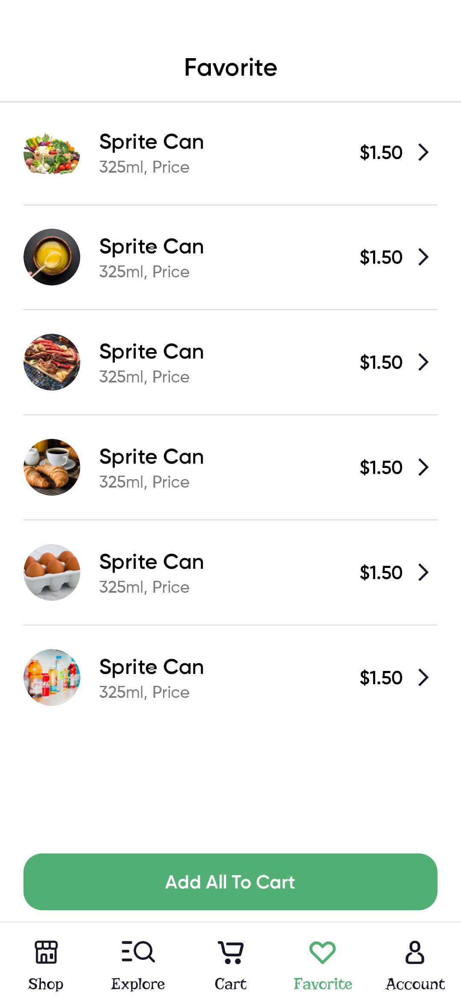

# 📱 Nectar Groceries App (React Native + Expo)

A beautiful grocery shopping app built with **React Native** using the **Expo** framework.

## 🚀 Getting Started

Follow these steps to get the app running locally.

### ⚙️ Prerequisites

- Node.js >= 16.x
- npm or yarn
- Expo CLI

```bash
npm install -g expo-cli
```

.
├── assets/ # App images, fonts
├── components/ # Shared UI components
├── constants/ # Colors, styles, dimensions
├── screens/ # Screen components
├── navigation/ # Navigation stack
├── demo/ # App screenshots for preview
├── App.js # Root component
└── README.md

### 🏠 Home Screen




### 🛒 Products



### 🛒 Cart



### 🛒 Explore




### 🛒 Favorite


